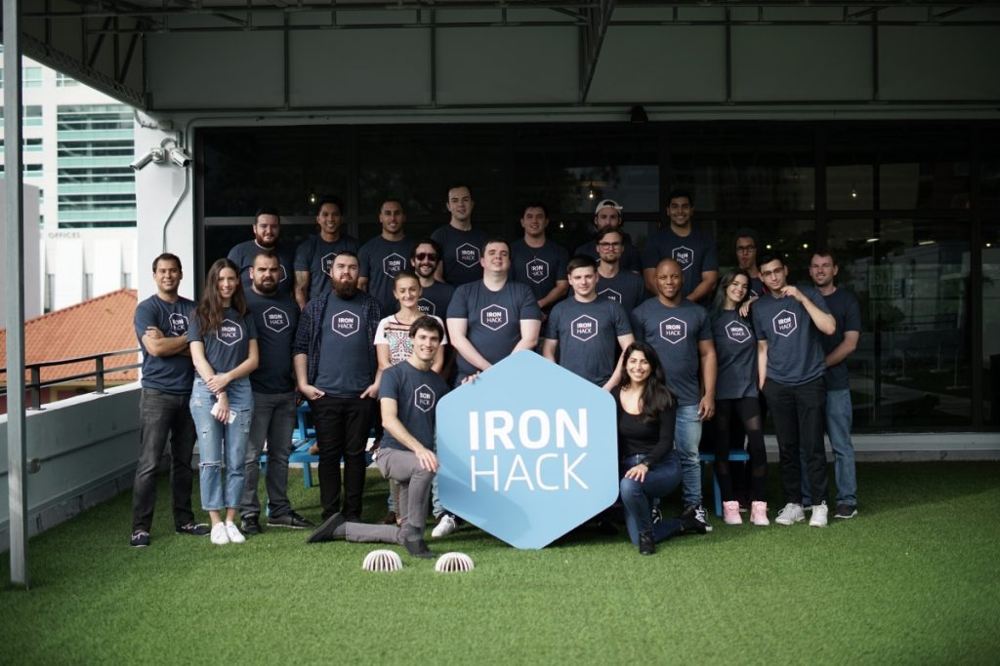
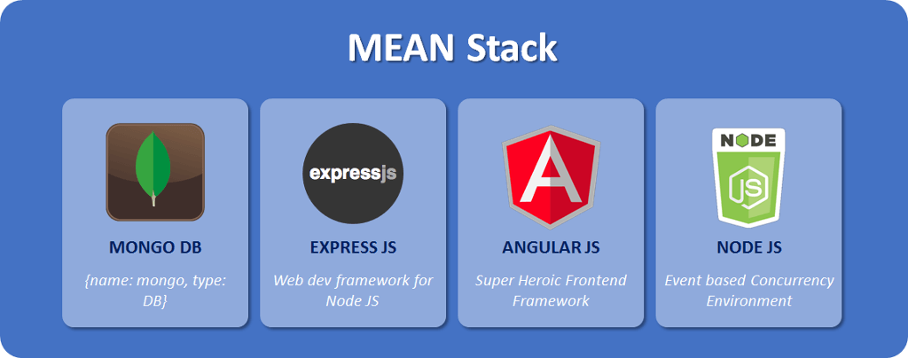
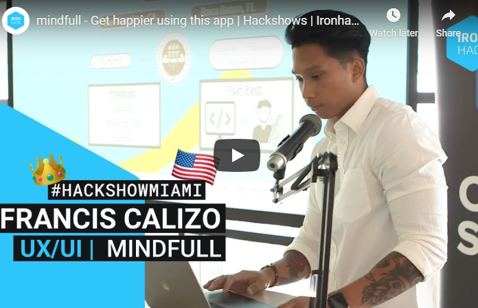

## Introduction

Coding bootcamps have become extremely popular over the years, showcasing the idea that you can become a Web Developer, UI/UX Designer, or Data Analyst without having to go through a four-year college to get a degree in order to do so. Some bootcamps can be completed in as little as 3 months and have caused a disruption in the traditional education system.

I won’t go into detail about what exactly they are as there’s plenty of resources and videos out there for that, but a coding bootcamp is a technical training program that teaches the skills that employers look for in jobs such as a web development position. The goal of attending a bootcamp is to transition you into a career in tech.

## Things To Consider Before Enrolling

#### The Pace and Intensity
They call it a bootcamp for a reason. Most bootcamps span the course of 9 weeks and require you to come in Mon-Fri from 9AM to 5PM, which comes out to be around 400+ hours of coursework total. **This is just the minimum requirement**. Later in this post, you will see that I was invested from almost **8AM-10PM** on Mon-Fri and a few hours on the weekends, so it ended up being closer to **550-600** hours of work.

Bootcamps are completely immersive and intense; their focus is to get you job ready in as little time as possible. In order to do that, they have to cram as much material as they can in those 9-12 weeks. And it’s not like they have random fluff topics in there, they provide everything that is needed to succeed in solving real world problems, so the topics tend to be much more difficult. **These courses take a lot of self-drive**.

#### Do It ONLY If You Actually Like Coding
Whenever you actually like to do something, whether that be working out, cooking, or dancing, chances are you tend to immerse yourself in that particular activity without even thinking about. Programming should be no different. I’m not saying this has to be the number one passion in your life, but you have to get at least some sort of excitement from writing thousands of lines of code.

Chances are if you’re considering to attend a coding bootcamp, you are trying to get a job and turn this into your career. This is will require you to (in most cases) work 40+ hours a week. I know many people, including myself, who came from other professions to learn how to code because they were not happy with their current profession. Why would you leave a job that you don’t enjoy just to get another job you don’t enjoy?

Yeah, yeah, I know. The **money**. Developers, Software Engineers, Coders (whatever the heck you want to call us) make pretty decent salaries, especially if you know what you’re doing. But the profession really isn’t for everyone. It requires a lot of problem-solving, analytical, and critical thinking. Not to mention a lot of staring at a screen.

#### Financial Cost
This is probably one of the biggest reasons why most people are skeptical of coding bootcamps: they come with a hefty price tag. I paid $12,000 in tuition for my particular bootcamp, and some bootcamps can even get as high as $16,000. I’m sure if they were $5,000 or less, most people would be more open to enrollment.  But at around $12,000-$16,000, you start to question how much can you really get out of those 3 months.

Not only do you have to consider tuition, but you may even have to consider relocation. Although coding bootcamps are starting to emerge in more cities, they still tend to only be in the more populated areas (New York, San Francisco, Seattle, Miami, etc.) And if you do decide to temporarily relocate to one of these cities, they definitely don’t run cheap. My bootcamp was in Miami, FL and a 3-month stay in an Airbnb was about $3,300 total. Then parking in the city was another $400 total. Make sure you have your finances in check if you ultimately decide a coding bootcamp is for you.

There are many cheaper alternatives out there. Some online programs will require you to have small monthly payment for access to all their videos. Some resources, like Udemy, will have you pay $10-$15 for a course. Hell, most of the resources out there are <u>**FREE**</u>.

#### Opportunity Cost
When you make the commitment to join one of these bootcamps, not only is your wallet down an initial $12,000-$16,000, but chances are you will not be working a full-time job or even working at all, which means you will not be having an income. There are part-time bootcamps that have night classes so that you’re able to go to work during the day, but that’s another story.

So now you’re with less (or zero) income during those 3 months. But it’s AT LEAST 3 months. Whose to say that you will find a job right after you graduate? Most bootcamps say that their graduates are able to find a job post graduation, but a lot fail to tell you that those stats are reflected over ANOTHER 3 months post graduation. So you can be without income for 6 months total. There is a possibility of missed opportunities during this period.

#### Not All Bootcamps Are Made Equal
**DO YOUR RESEARCH**. Joe Schmo’s Bootcamp may be $3,000 less than the other bootcamps around, but is it worth you getting a sub-par education and digging yourself into a hole after those three wasted months? There are so many resources out there to see reviews and feedback on different bootcamps. My favorite two were Course Report and SwitchUp. The great thing about those sites are that the students that leave reviews usually have their LinkedIn connected to the review, so you can message them and ask them about more details (and to make sure they aren’t fake reviews!). That’s exactly what I did and was able to find a legit bootcamp.

#### Expectations vs. Reality
**I truly believe this is the most important consideration on this list**. Go take a look at any of the coding bootcamp websites or advertisements. Any of them. There’s a big chance you’ll see something like “Become a coding ninja in just 3-months!” or “Our graduates go from beginner to expert level developers in just 9 weeks!”.

This really isn’t the case. Don’t get me wrong, you can learn SO MUCH in those 3 months. But it’s just that: **3 months**. Would you consider somebody that’s only worked out for 3 months an expert at fitness? No. How about somebody that’s only learned how to cook for the past 3 months? Are they an expert as well? Probably not.

There is only so much you can learn in 3 months, and a lot of that depends on how well the Bootcamp curriculum and program is structured. But bootcamps will market that their program will offer that instant gratification of a $70K job right after the program. But those people that are able to land a job right after bust their ass to do so. If you have the intent of walking in, doing some of the work, and being handed you an entry-level developer role at a great company, you <u>will</u> be humbled very quickly.

## My Bootcamp Experience

*Disclaimer*: Ironhack **is not** asking me to write this. So everything in this post is my honest opinion. It’s also important to note that this review is based on **my** particular experience at **my** particular bootcamp. Every experience and bootcamp will differ, for better or for worse.

#### Pre-Coding
##### November 2017 (2 months before bootcamp)
So to start things off, I didn’t really know much about coding. I had taken a course in college called Intro to Programming that dealt with C++ and to put it lightly, I absolutely hated it. I dropped the course the first time (it was a required course for my degree, damn you Applied and Computational Mathematics!). And that’s about as far as my coding experience went. I ended up passing the course with a C+ (the irony) and I want to say 5 out of my 6 projects were me looking for someone else’s code online, which I late found out to be GitHub. Oops.

Fast forward to November 2017. I had just recently quit my job as a Director of Operations for a nutritional supplement company and was looking for a new career. At first, I figured I’d do something with my applied and computational mathematics and statistics degree, so I originally wanted to learn SQL (which I sort of did via some courses on Udemy), as well as data analytics.

But something else caught my attention on the sidebar of the courses list: **Web Development**. I saw that it dealt with HTML/CSS and I had some familiarity with those from the MySpace days (RIP). I looked into it and figured I’d give it a look since I was no longer working and had a lot of free time.

#### Pre-Bootcamp
##### December 2017 (1 month before bootcamp)
Before I even knew what a bootcamp was, I bought an $11.00 course from Colt Steele on Web Development from Udemy (highly recommended!). I worked on this course for about 5 hours a day for 2 weeks and honestly I was hooked. I found a lot of enjoyment is seeing my code come into fruition on web browsers, and the complex thinking was something I was used to from the advanced math classes in my college days.

At this point, I thought I was going to self-teach myself everything and find an entry-level developer job that way. BUT DAMN are there a lot of resources out there. Too many. Way too many. It was so overwhelming to me, I had nowhere to start. For the third week, I felt like I was still stuck in the “tutorial stage”, where everything I was learning was just so tutorial-based and only focused on total beginners. I was writing line-for-line the same exact thing that these people in the videos were writing.

And that wasn’t helping me learn. I knew I had to do something different. This is when I read up on bootcamps. I was a bit skeptical at first, and I’m assuming you are too if you’re reading this post. After about 5 days and with the advice of one of my friends who was a CodingDojo bootcamp grad (thanks Andrew!), I enrolled at **Ironhack** for their **Web-Development Bootcamp (MEAN Stack)** for their January 2018 cohort.

#### Ironhack Coding Bootcamp
Ironhack is an international-based bootcamp with many locations all over the world, including Madrid, Paris, Mexico City, and Miami. Seeing as I lived in Boca Raton, FL at the time, I decided to enroll at the Miami, FL location.

Ironhack offers both Web-Development and UI/UX design courses. At the time of this post, I believe they just added a new course, Data Analytics, as well. The Web-Development course was teaching the MEAN stack when I enrolled, but I believe they are teaching the MERN stack (again, at the time of this post).  They offer both full-time and part-time courses.

The tuition was **$12,000 for a 9-week full-time course**. Yes, you read that correctly. A hefty investment indeed. They do offer financing options, as well as scholarships. ~~Pro-tip: If you know an alum (hint, hint: me), they can refer you to the school and you will get an instant $500 off your tuition and you’ll get the alum (aka lil ole’ me) an extra $500 as well~~ (Apparently this isn't a thing anymore 😢).

The school is located in a shared space in Brickell, FL. Yes, everything around there is expensive, including parking, food, and drinks. It is Miami, after-all.

You can find out more about Ironhack [here](https://ironhack.com).

#### The Finances
I wont go too in-depth (or should I say, in-debt ) about this, but I just want to give you an idea of some of the expenses you can incur over a period of only 3 months. Here was my financial breakdown:

* **Tuition – $12,000.00**
  * I chose to pay up front, without using any financing options.
  * I did however, get $500 off from a referral (thanks Ryan!)
* **Housing – $3,300.00**
  * I did live in Boca Raton, but that’s still a 1.5 hr drive during rush hour to Miami, and then I would have to do it again on the way back. That was not happening.
  * I chose to stay in an Airbnb in North Miami that was still 30 minutes way from the school but was significantly cheaper
  * It came out to about $1,100 per month I was there
* **Parking – $400.00**
  * The school is within the city and let’s just say parking ain’t cheap
  * It was a nearby parking garage about a block away from the school

So right out of the gates, I was down almost **$16,000.00** and hadn’t even started the damn bootcamp yet. This doesn’t even factor in my **food costs, gas costs** (I was still 30 mins away from the school even with an Airbnb in the area, thanks Miami traffic), and **a new laptop** (my old PC was horrible, so I invested in a few year old Macbook Pro). Also, I used a lot of money during our nightlife outings. Coding for 10-12 hrs straight for 5 days a week gets stressful, and you have to unwind somehow. So I would say another $2,000 at least on top of that $16,000.

So I would say my bootcamp cost me roughly $18,000.00 over that 3-month period. Yikes. This is something you should definitely map out before you commit.

#### The Curriculum and Schedule

I enrolled in the 9-week Web Development bootcamp for the January 2018 Cohort. This program focused on learning the **MEAN** stack (Mongo, Express, Angular, Node). Over the course of 9 weeks, this is how the curriculum was structured:

* <u>Weeks 1-2</u>
  * HTML/CSS/JavaScript introduction and further understanding
  * Git and Github introduction and further understanding
  * Intro to Canvas

* <u>Week 3 (Project Week)</u>
  * Create a game-based project using canvas on HTML, CSS, JS

* <u>Weeks 4-5</u>
  * Intro to NodeJS, MongoDB, Express and further understanding
  * Working with APIs, AJAX, Authentication/Authorization, deployment

* <u>Week 6</u>
  * Create a full stack application using NodeJS, Express, and MongoDB

* <u>Week 7</u>
  * Intro to Angular 2 and TypeScript
  * Incorporating Angular 2 with Express, MongoDB, and NodeJS

* <u>Weeks 8-9</u>
  * Create a MEAN Stack application (the final project)

* <u>Post Bootcamp (Week 10)</u>
  * Personal and technical interview workshops
  * Portfolio preparation and job hunting tips
  * Hiring Fair

  This is obviously a high level overview of how the curriculum was structured. When it came down to how the daily schedule broke down, this is how **my personal** daily schedule was laid out while attending the bootcamp (Note: The actual bootcamp daily schedule is from 9AM-5PM, but you’ll see below that wasn’t the case for me at all:

* <u>4:45 AM (lol)</u>
  * Wake up
  * 2 hr workout
  * Shower, change, and pack my lunch
  * Leave for the bootcamp (30 min drive from Airbnb)
* <u>8:00 AM</u>
  * Arrive at bootcamp
  * Get free ~~coding fuel~~ coffee
  * Read ahead on the day’s lecture or work on program from prior day
* <u>9:00 AM:</u>
  * Class begins with discussion on program from prior day
  * 1 hour lecture
* <u>10:15 AM:</u>
  * 15-20 Minute break
  * Begin next lecture
* <u>11:30 AM:</u>
  * Paired programming exercise for the day
* <u>1:00 PM:</u>
  * Lunch Break
* <u>2:00 PM:</u>
  * Next lecture begins
* <u>3:00 PM:</u>
  * 15-20 Minute Break
  *Final Hour lecture for the day
* <u>4:00 PM:</u>
  * Individual programming exercise and/or finish paired programming
* <u>5:00 PM</u>
  * ~~Leave~~
  * Continue working on programming exercises
* <u>8:00PM</u>
  * Eat dinner (which was technically just leftovers from lunch)
  * Continue working on programming exercises (you see the trend here)
* <u>10:00 PM or 11:00 PM</u>
  * Leave for Airbnb
  * Shower
* <u>12:00 AM</u>
  * Sleep and sometimes dream in code

**and repeat.**

As you can see, I invested a little more time than the recommended 9AM-5PM and you should too. There’s only 3 months of the bootcamp for you to learn as much as you can, it’s worth it to go in there with maximum effort.

### My Review
**I absolutely loved my bootcamp experience. I would give my experience as a whole a 9/10.**

I wouldn’t say it was perfect, but it was pretty damn close. Everything from the actual course, the community, the events, and even the struggles and stress. I woke up everyday excited to go to Ironhack and see my classmates. I was eager to learn. That’s not something I think I ever said back in college and in high school.

I learned so much throughout the 9-week course and not even just programming related. I improved on soft skills, time management, responsibility, and ~~dealing with Miami drivers~~. It’s an experience that I’ll never forget and was actually pretty sad once it all ended. Like I said, it wasn’t perfect and it did have it’s ups and downs, so let’s dig a little deeper:

#### The Pros
##### The Result
My main goal was to land a job once I graduated. And I was able to accomplish that after only <u>**5**</u> days upon completing the course. I was hired by 1 of the 5 companies I interviewed with during the hiring fair.

However, outside of the 5 companies at the hiring fair, I applied to about 8 other jobs and only heard back from 1 of them. I got to a third round of interviews for that particular company, but ultimately took the role at one of the companies I met with at the Ironhack hiring fair.

Aside from landing a job, this bootcamp really taught me how to learn. There are so many resources out there that it can become overbearing, but I was taught how to find and focus on the important topics that I would actually need in my career and what it takes to learn new technologies. This is extremely important because technology is constantly growing and changing, it’s imperative that you keep up with it in order to stay relevant.

##### The Curriculum
*Obviously* this differs between what bootcamp you attend and what your goal is for learning. But the curriculum we learned was on Web-Development, particularly using the HTML, CSS, JavaScript and the MEAN Stack.  This is a very in-demand stack to learn (although MERN and MEVN stacks are starting to show more popularity), so the job opportunities for those that are knowledgable are endless.

The languages and the stack itself were very enjoyable to learn. The satisfaction of being able to see your lines of code turn into a fully functional webpage was indescribable. And because JavaScript is such a popular and in-demand language, the resources to learn and get help from were endless.

##### The Environment
*Again, this obviously this differs between what bootcamp you attend*. I’ll be the first to admit that I am not the biggest fan of the city of Miami. But the location and environment of Ironhack was incredible.

The bootcamp is on the third floor of a very modern co-working space in Brickell. The space was shared by a lot of other great startups and tech companies, including Tesla! On the third floor was an open rooftop that had superb views of the city. The classroom had a very modern and sleek design that featured many clear glass walls and conference rooms.

This kind of environment made it very enjoyable just to be around and to learn code. Because of the other great tech companies around, it was almost used as motivation that you could be a part of that one day if you put in the work.

The co-working space and Ironhack also hosted a lot of free tech events (**with free beer too**) that you were able network and learn from. There were great areas to study and to relax in the building as well. And because of it’s location in Brickell, it was next to a lot of great restaurants, bars, and shopping areas.

##### The Staff
*You know the drill. This differs between what bootcamp you attend*. During my cohort, there was a bit of a problem with the head instructor that I won’t get too much into detail on. But long story short, the original instructor had moved to a different Ironhack location in Paris and was replaced by another instructor who was quite a bit inexperienced with JavaScript. It did make an impact on our learning, but overall wasn’t absolutely detrimental. He was honestly a super nice guy as well, but wasn’t the best teacher for the actual curriculum.

The teaching assistants we had were awesome. We had two very helpful and knowledgable TA’s that stayed after hours consistently to help us on our projects and with general coding questions. The great thing about the TA’s is that they were graduates of the bootcamp as well, so they knew all the ins and outs of what us students were going through.

If there was something that my particular bootcamp excelled at, it was in the outcomes department. The outcomes manager was one of a kind and prepared everyone on how to not just get ready for the job hunt, but specifically doing it as a developer. There were multiple lectures, soft-skills interviews, technical interviews, and portfolio workshops to help us through our journey. At the end of it, he set up a hiring fair with multiple companies in which each student was able to interview with at least 3-4 companies. If you’re familiar with the looking for a job, you know just getting to the interview portion can sometimes be a hassle, so the fact that you’re already guaranteed 3-4 interviews was a blessing.

##### The Community
This was such an important aspect of the bootcamp. There were 19 other students in my cohort and I would spend at least 8 hours daily with them, usually even more. They all had the same goal as I did and so it was great to be surrounded by like-minded individuals.

Not only were our goals the same, but our struggles were the same too. If I was struggling on a particular concept or exercise, more likely than not somebody else was as well. Because of this, I was able to work with others to get to a common solution, which also helped with team skills and communication.

Because we were with each other so often, we would also go to lunches, bars, and clubs together. It created a little tight-knit family for those 3 months, and I’m happy to say that I still communicate with some of them regularly.

#### The Cons
##### The Price
This was by far the biggest bummer of the whole experience. Like I mentioned earlier, I spent roughly $16,000.00 on the tuition, housing, and parking <u>**alone**</u>. This did not include:

  * Food and drink
  * Transportation and gas
  * Nightlife and networking events
  * A laptop for the course

Also, since I was doing this course full time, I was not making any income at the time, so the opportunity cost was affecting me as well. My return on investment ended up working out since I was able to land a job so quickly, but it wont always work out that way for everyone.

##### The Workload
If you read the description of the bootcamp, it says you will be dedicating about 400 hours of time to the course during those 9 weeks. I was able to estimate the I actually did closer to <u>**550-600**</u> hours of dedication during that period.

The course structure says that the course is Mon-Fri from 9AM-5PM and would require some work on the weekends. If you recall from my schedule above, I was doing about 8AM-10PM on the weekdays, and then anther 4-6 hours on Saturday and Sunday each. **Coding was life**.

It was difficult to meet with friends, set up plans, etc. during those 9 weeks. I did and still do enjoy coding, but those 9-weeks were on a whole new level.

##### The Expectations
Many, if not all, bootcamps push the narrative that in these 9-weeks you will be “JavaScript Wizard” and companies will be throwing money at you once you finish your last project. And when people hear that, they feel like that all they have to do is show up and it’ll happen.

News flash: the bootcamp is only 3 months and theres only so much you can learn in that short amount of time. If you’re expecting companies to want to hire you, you have to show that you can provide value to them.

There was a reason I was in the classroom for 8AM-10PM instead of 9AM-5PM. I wanted to be a great developer, but just an average one. I put in that extra effort and it paid off in the end. Some people don’t have to work as hard and the material just clicks. But for others, like me, you really have to bust your ass.

## The Final Word
Are coding bootcamps worth it? The answer I’m going to give you is probably not the answer you want to hear, but: <u>***it depends***</u>.

If programming is something that you really want to do as a passion and see as a career, then yes a bootcamp is worth it.

If you’re unable to learn things by just using the resources online or you need a structured curriculum and teacher leading the way, then yes a bootcamp is worth it.

If you want to surround yourself with others that are working toward a common goal and with a community that you can get help with or even provide help for, then yes a bootcamp is worth it.

If you can swallow the large financial cost or get a scholarship, then yes a bootcamp is worth it.

If you are able to fully immerse yourself in the course for the 9 weeks, then yes a bootcamp is worth it.

If you are persistent, you will definitely make the most out of a coding bootcamp. **The more you put in, the more you will get out of it**. It’s only 9 weeks, <u>invest in it and in yourself</u>. Come in with an **open mind, eagerness to learn**, and a **positive attitude** and you will have yourself a very solid investment.

## Final Project
Ironhack filmed my final project presentation and uploaded it. So here it is. I apologize for the 165 “uhs” and “ums”, public speaking ain’t my cup of tea:

