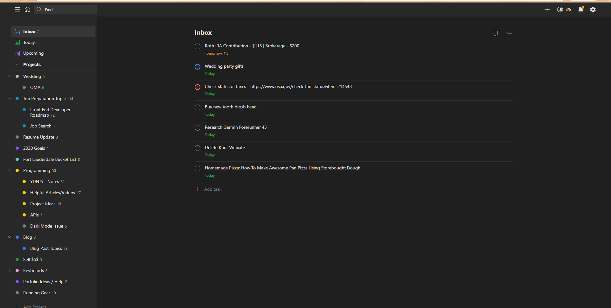

**Stay tuned, this blog post <u>isn't</u> finished!**

Back in 2018, I vividly remember talking to a classmate of mine while waiting for our web development lecture to start. After a few minutes of conversing, he ended our exchange by calling me a "machine...a well-oiled machine". His description of a "machine" was referring to my productivity (hopefully not that I had a personality of a robot), and I was flattered by that compliment.

It was about one year later that I made sure to try to track and maintain that same level of efficiency that I had while in school. I began recollecting what it was that made me so effective in my day-to-day tasks, and what kept me so motivated me to be so responsible in getting sh*t done. Here's how I was able to accomplish that.

## How I Became More Productive
---

### 1. Use a TO-DO app for tasks and "brain dumps"

Ah yes, the *To-do List*. AKA the other set of words that developers loathe that aren't `hello world`. I guarantee if you search any other articles relating to *'How to be productive'* or *'How to stop procrastinating'*, this will ultimately be on their list of things...to do (**** *ba dum tssssss* ****).

And there's a reason for that: **it holds you accountable**. The to-do list one of the few things I made sure to check daily (along with my bank account and statements!). My prefered app to use is <a href="https://todoist.com/app/" target="_blank">Todoist</a>. It's extremely simple and effective; none of that extra filler stuff that could distract you. It's just everything that you expect out of a to-do app.

In just the first week, I was able to feel **much** more accomplished just by marking things complete off my list. And that created a **snowball effect**. Once I finished one task, it made me want to keep knocking things off the list. And it didn't matter if it was something big like finally writing this blog post (*shrugs*), or making sure to call someone back.

The second thing that made this to-do app so powerful was that it acted as place for a "brain dump". Think about it. How many times have you thought about something that you had to do, only to completely forget about it five minutes later and then realize a week later that you forgot to do it? You've probably lost count. It doesn't even have to refer to a task you have to do. Sometimes a great idea pops into your head (*maybe* that next million dollar idea!), but you just don't have the time to dwell on it because you're out to dinner with some friends. All you have to do is put it into your to-do app (I like to just dump it into the *inbox* section of Todoist and categorize it later on) and now you can worry about it at a more necessary time. Don't tell me that's too much work, because it's literally the same amount of effort and time as texting somebody.

With the amount of distractions these days (aka Technology), this first step is vital. Create a to-do list via an app on your phone. Use it as a brain dump area. Check it daily. Get things done. Reap the rewards.

### 2. Set both long-term AND short-term goals

**"What gets measured gets managed."**

Whatever it is you want to accomplish, write it down and set it as a goal that you want to achieve. Keep track of your results to see if you are getting closer to completing your goal. The more specific, the better. Let's take an easy example:

Let's say "I want to lose weight". Well, that's a pretty general statement. Let's get more specific. "I want to lose 15 lbs". That's better, but lets describe a timeframe so that you can accomplish that goal in a reasonable amount of time. "I want to lose 15 lbs in three months". This is a goal that you can now easily measure and manage.

Although you do not want to set too many goals as to overwhelm yourself, I recommend setting a few short-term and long-term goals. Knocking out the short-term goals will give you a sense of satisfaction and reward while motivating you to get your long term goals accomplished as well.

### 3. Follow a schedule/routine

### 4. Less music, more podcasts

I still remember the day that I made this one of my New Year's Resolutions...you know, the ones you make and give up after 30 days? But for this one, that wasn't the case. This was actually one of the most enjoyable transitions I introduced into my life.

Now don't get me wrong. I **LOVE** music. I listen to about 2-3 hours of music daily (I workout and run almost everyday and doing that to silence just isn't my cup of tea). But bringing in podcasts into my daily routine gave me a sense of accomplishment and satisfaction. I began listening to podcasts about finance, business, and eventually software deveopment.

Instead of hearing the same songs over and over again everyday during my 30-minute commute, I was absorbing tons of useful information that I knew I would be able to apply in my daily life. It's understandable that you won't be able to retain all the information if you're driving or if you're working out because lets face it: multi-tasking and retention to not go hand-in-hand. But just being exposed to to the information and being able to listen to it over and over again, I was able to learn so many new things.

Up until this day, I still listen to my software development podcast during my commutes and then a comedy podcast during my lunch break. And then from time to time, I'll switch it up with financial podcasts here and there. I can confidently say that I apply much of what I've learned in these podcasts (*especially* the software development and financial ones) to my everyday life.

Here's a few podcasts that I love:

<a href="https://syntax.fm/" target="_blank">SyntaxFM</a> - A deep dive into web development topics hosted by two full-stack web developers.
 

<a href="https://www.choosefi.com/" target="_blank">ChooseFI</a> - For those pursuing financial independence through investing, real estate & business creation.
 

<a href="http://www.spitballerspod.com/" target="_blank">Spitballers Pod</a> - A comedy podcast featuring three dads as they discuss ridiculous topics.
 

<a href="https://www.npr.org/podcasts/510313/how-i-built-this" target="_blank">How I Built This</a> - Stories behind the movements innovators, entrepreneurs, and idealists built.

### 5. Less social media; limit brands & celebrities

Two years ago for <a href="https://en.wikipedia.org/wiki/Lent" target="blank">lent</a>, I decided to give up all social media outlets for a 40-day period. I chose to give this up not only because I felt like it would actually be a challenge (I spend way too much time on my phone 🤷), but I felt that this would actually benefit me as well.

And it did.

So for this six-week period, I was without Instagram, Snapchat, Facebook, LinkedIn, and twitter (sometimes on Sundays I would check Instagram. When I was younger, I was told that Sundays were rest days and that you were able to skip whatever it was you were abstaining. Not sure how much truth there is to that though.) The results were as follows:

#### - Less Time wasted

The first week was pretty brutal. According to the screen-time app on my phone, I currently spend about 2.5 to 3 hours on my phone daily, and I tend to pick up my phone randomly just to check on things because I'm bored. And during those first few days, I realized how much I actually pick up my phone with absolutely no intention at all. I would grab it every ten minutes and realize that I couldn't click on any of the social media widgets and put it down. Ten minutes later, I would subconsciously just pick up my phone without even realizing it, just to arrive at the same result.

I learned that if I didn't give up social media for lent, then those times that I picked up the phone would have probably resulted in me clicking endlessly through posts on all platforms, leading to about 20 mins+ of time wasted. During those 40 days, I drastically reduced my screen time and increased productivity just by eliminating the source of all my distractions.

After the season of lent, I eased back into social media outlets and saw that I started to waste time again on these platforms. I would see one post and look at it, then see a related post and read it, and I would go down a rabbit-hole of endless posts that had nothing to do with the original post. It was just a period of aimless scrolling and, I made an effort to reduce my time on all these apps.

