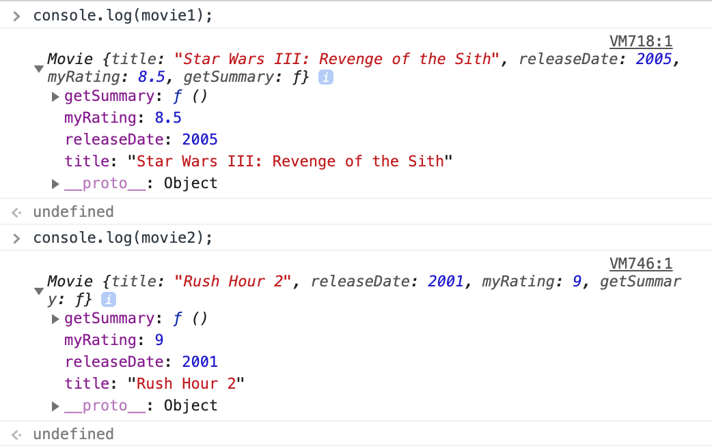

**Stay tuned, this blog post <u>isn't</u> finished!**

Object-oriented programming (OOP) is the concept of using objects to represent data and methods, and objects are a collection of associated properties and values. The idea is to use objects to model real world things that we want to represent inside our programs.

OOP in JavaScript is a bit different than OOP in other languages, like Java and C++. Let's take a quick look on how OOP theory can be put into practice in JavaScript (This post assumes you understand the basic structure of an object literal).

## Constructors

In JavaScript, special functions called constructor functions are used to define and initialize objects and their features. This provides a way to create an many objects as you wish while being able to attach data and methods to them. With constructor functions, you are able to create (or *instantiate*) instances on an object. Constructors are useful when you want to create multiple similar objects with the same properties and methods. In simpler terms, constructors can be viewed almost as a template to create other objects.

Let's say we want to create a few *movie* objects. Each movie object will have the following properties: `title`, `releaseDate` , and `myRating`. The movie object will also have a method on it called `getSummary()` that will give a brief summary of the movie using its given properties.

One might be tempted to type them out as object literals such as this:

```javascript
let movie1 = {
  title: 'Star Wars III: Revenge of the sith',
  releaseDate: 2005,
  myRating: 8.8,

  getSummary: function(){
    return `${this.title} was release in ${this.releaseDate}. I give it a  ${this.myRating}/10.`;
  }
}

let movie2 = {
  title: 'Rush Hour 2',
  releaseDate: 2001, // Wow, I feel old.
  myRating: 9.0,

  getSummary: function(){
    return `${this.title} was release in ${this.releaseDate}. I give it a  ${this.myRating}/10.`;
  }
}
```

While there is nothing wrong with defining them this way, it could become a bit tedious. Not to mention the `getSummary()` function is being repeated multiple times. This is not the ***DRY*** code you're looking for. This is where OOP and constructors can come to the rescue:

```javascript
// Constructor Function
function Movie(title, releaseDate, myRating) {
  this.title = title;
  this.releaseDate = releaseDate;
  this.myRating = myRating;

  this.getSummary = function() {
    return `${this.title} was release in ${this.releaseDate}. I give it a  ${this.myRating}/10.`;
  };
}
```

As you can see, a constructor is just a function. *Note that it is a common naming convention to start the constructor (and later on classes) with a capital letter, although this plays no part in how the code actually functions*.

The constructor function will take in the three arguments we mentioned above: `title`, `releaseDate`, and `myRating`. In this function, the `this` keyword refers to the object itself. It will be a subtitute for the new object when a new object is created from the constructor through instantiation. Lastly, we attach the method on there and *voila*! We have our constructor function!

Okay, so now what? Remember that we initially wanted to create multiple movie objects. We can now do that with the Movie constructor function we just created!

```javascript
// Constructor Function
function Movie(title, releaseDate, myRating) {
  this.title = title;
  this.releaseDate = releaseDate;
  this.myRating = myRating;

  this.getSummary = function() {
    return `${this.title} was release in ${this.releaseDate}. I give it a  ${this.myRating}/10.`;
  };
}

// Instantiate An Object From The Constructor
const movie1 = new Movie('Star Wars III: Revenge of the Sith', 2005, 8.5);
const movie2 = new Movie('Rush Hour 2', 2001, 9.0);

console.log(movie1.title) // Star Wars III: Revenge of the Sith
console.log(movie2.title) // Rush Hour 2
console.log(movie2.myRating) // 9.0
console.log(movie1.getSummary()) // Star Wars III: Revenge of the Sith was release in 2005. I give it a  8.5/10.
```

As you can see, we instantiate a new instance of the contructor by assigning the `new` keyword to the name of the constructor function, `Movie`, and pass in our arguments. Much better than righting out each object literal! But let's take a closer look at the `getSummary()` method. When we output both of our objects into the console, here's what we see:



You'll notice that both of our functions contain the method `getSummary()`. This may seem okay, but what is happening is that we are actually generating a `new` function for each instance, and assigning that as a property. We are basically duplicating methods per each new instance. How would be able to make this better? By adding the method to the prototype, we can have all instances share that function for that property, i.e all instances will have access to those methods. Also by attaching the method to prototypes instead of the constructor, we forego the ability for the method to have access to any "private" variable. Let's take a look at prototypes.

## Prototypes

Prototype are the mechanism by which JavaScript objects inherit features from one another. All objects in JavaScript have a prototype, all objects in JavaScript inherit methods from a prototype. Objects can have a prototype objectm which acts as a template object that it inherits methods and properties from. The JavaScript prototype property allows you to add new properties and methods to object constructors.

```javascript
// Constructor Function
function Movie(title, releaseDate, myRating) {
  this.title = title;
  this.releaseDate = releaseDate;
  this.myRating = myRating;
}

// Add Method to Movie Prototype
Movie.prototype.getSummary = function () {
  return `${this.title} was release in ${this.releaseDate}. I give it a  ${this.myRating}/10.`;
};

const movie1 = new Movie('Star Wars III: Revenge of the Sith', 2005, 8.5);
console.log(movie1.getSummary()) // Star Wars III: Revenge of the Sith was release in 2005. I give it a  8.5/10.
```

## Inheritance

Inheritance in OOP is an object's ability to access methods and other properties from another object. It is the concept of one thing (an object) gaining the behaviors (properties) of something else (another object). Inheritance in JavaScript differs quite a bit than inheritance in standard object-oriented programming languages. While other languages utilize *classical inheritance*, inheritance in JavaScript works through prototypes and this form of inheritance is called *prototypal inheritance*.

## Classes

Classes are primarily syntactical sugar over the existing prototype-based inheritance found in JavaScript. You can think of classes as a type of function which its properties assigned inside its constructor method. The constructor method lets us set fields and is called each time the class object is initialized.

#### Static Methods

The static keyword defines a static method for a class. Static methods have no access to data stored in specific objects and aren't called on instances of a class. They are called on the class itself and are often utlity funcitons.

## Subclasses

A subclass is a class that inherits all properties of another class while being able to add or modify properties, similar to how inheritance works with constructors functions and instantiation (explained above).

#### The super() method

The super() method is used to access and call functions on an object's parent. By calling the super() method, we call the parent's constuctor method and get access to the parent's properties and methods.
