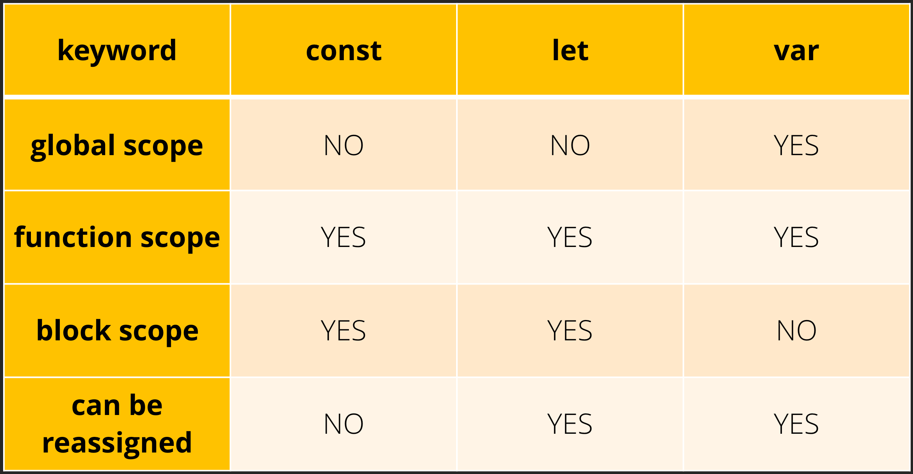

### TLDR;

*Graphic provided by <a href="http://constletvar.com" target="_blank">constletvar.com</a>*

## Intro

`let` and `const` are two "newer" (I think ES6 is pretty much widely adopted at this point) types of variable declarations that have gained extreme popularity and usage in this day and age. But before then, `var` ruled as King 👑. Let's take a look at each of the three and explain their uses and differences in JavaScript.

## var

Before the emergence of ES6, variable declaration was traditionally done with the`var` keyword.

```javascript
var name = 'Francis';

console.log(name) // 'Francis'
```

Here, you are declaring a variable called `name` and assigning it a string called `'Francis'`. Easy enough. We can also write it this way:

```javascript
var name;

name = 'Francis';

console.log(name) // 'Francis'
```
As you can see, we don't have to declare and assign a value to the variable on the same line. Lastly, we can do it this way as well:

```javascript
name = 'Francis';

var name;

console.log(name) // 'Francis'
```
We can assign a value to the variable before it is even declared, thanks to ***hoisting***.

### Scope of var

You can think of **scope** as the parts of your program where you can use or see a variable; it's where these varaiables are available for use. `var` is said to be <u>*function-scoped*</u>.
This means it is accessible anywhere within their containing function.

```javascript
function getMoney() {
  var money = 10;

  return money; // returns 10
}

console.log(money); // money is not defined here
```

But if we were to define `money` in the **global scope** outside of the function, we would have access to it:


```javascript
var money = 10;

function getMoney() {
  return money; // returns 10
}

console.log(money); // 10
```

Remember, **variables defined with `var` are accessible anywhere within their containing function**. The scope of `var` has created issues for many however. Variables declared with `var` are can be scoped within a function-block, but are still accessible if defined within `if` and `for` blocks:

```javascript
function getMoney(hasMoney) {
  if (hasMoney) {
      var x = 300;
  }

  return x;
}

getMoney(true);  // returns '10'
getMoney(false); // returns 'undefined'
```

The variable `x` was declared within the `if` block, and we were still able to access it from outside of that block. These scoping rules can cause several kinds of mistakes. We are also able to **redeclare** `var` variables:

```javascript
var theChosenOne = 'Anakin Skywalker';
var theChosenOne = 'Darth Vader';

console.log(theChosenOne) // 'Darth Vader'
```

Little quirks like these are why `let` and `const` were introduced into the language. Let's see how they differ and how you can use them to write code effectively.

## let

`let` statements are written the same way that `var` statements are:

```javascript
let name = 'Francis';

console.log(name) // 'Francis'
```

Now let's dive into the semantics of `let`.

## Scope of let

While we learned that `var` has *function-scope*, `let` has what we call *block-scoping*. Block-scoped variables are not visible outside of their nearest containing block or `for` loop. Let's look at a quick comparison to `var` using the same example we used above:

```javascript
// Declare 'x' with var
function getMoney(hasMoney) {
  if (hasMoney) {
      var x = 300;
  }

  return x;
}

getMoney(true);  // returns '10'
getMoney(false); // returns 'undefined'

// Declare 'x' with let
function getMoney(hasMoney) {
  if (hasMoney) {
    let x = 300;
  }

  return x;
}

console.log(getMoney(true)); // ReferenceError! x is not defined
console.log(getMoney(false)); // ReferenceError! x is not defined
```

What's happening here? On the top function, because `var` is function-scoped and the variable `x` was declared within the `if` block, and we were still able to access it from outside of that block. On the bottom, we have the variable `x`defined with `let`, the scope is limited to the containing `if` statement block and is not accessible outside of that block, therefore resulting in a `ReferenceError`.

Let's take a look at another comparison, except with *hoisting*:

```javascript
// Using var
name = 'Francis';

var name;

console.log(name) // 'Francis'

// Using let
age = 28;

let age;

console.log(age); // ReferenceError! Cannot access 'age' before initialization


```
When using `var`, we can assign a value to the variable before it's even declared. But with `let`, variables can't be read or written to before they're actually declared.

Lastly, lets take a look at re-declarations:

```javascript
// Declare with var
var theChosenOne = 'Anakin Skywalker';
var theChosenOne = 'Darth Vader';

console.log(theChosenOne) // 'Darth Vader'

// Declare with let
let theFakeChosenOne = 'Rey Palpatine';
let theFakeChosenOne = 'Rey Skywalker'; // SyntaxError: Identifier 'theFakeChosenOne' has already been declared
```

Again with `var`, we are able to redeclare a variable which could lead to some nasty bugs in the future. But with `let` we will get a `Syntax Error` if we try to redeclare a variable within <u>*the same block*</u>. *Note*: that’s not to say that a block-scoped variable can never be declared with a function-scoped variable. The block-scoped variable just needs to be declared within a distinctly different block:

```javascript
function sayUncle(bool, name) {
  if (bool) {
    let x = name;
    return x;
  }

  return 'Grandma';
}

sayUncle(false, 'Uncle'); // returns 'Grandma'
sayUncle(true, 'Uncle'); // returns 'Uncle'
```

## const

`const` is similar to `let`, but with one big difference: *variables declared with `const` maintain constant values*. This means that `const` variables cannot be reassigned:

```javascript
const name = 'Francis';

name = 'Michael Scott'; // Uncaught TypeError: Assignment to constant variable
```

One key takeaway from this definition is that although you aren't able to reassign a value to `const`, this doesn't mean this variable is ***immutable***. Here's an example:

```javascript
const person = {
  name: 'Mando'
}

person.name = 'Cara Dune' // This works

person = {} // Uncaught TypeError: Assignment to constant variable.
```

Notice that changing a property on an object isn’t reassigning it, so even though an object is declared with `const`, that doesn’t mean you can’t mutate any of its properties. It only means you can’t reassign it to a new value.

Like I said earlier, it is similar to `let` in terms of block-scope and hoisting.

`const` also must be initialized during declaration:

```javascript
var name; // this works

let age; // this works

const weight; // Uncaught SyntaxError; Missing initializer in const declaration
```

## So... Which One Do I Use?

The popular opinion is that you should always use `const` unless you know the variable is going to change. If it will need to change (like in a for loop), you should use let. `var` is typically never used anymore in modern JavaScript.